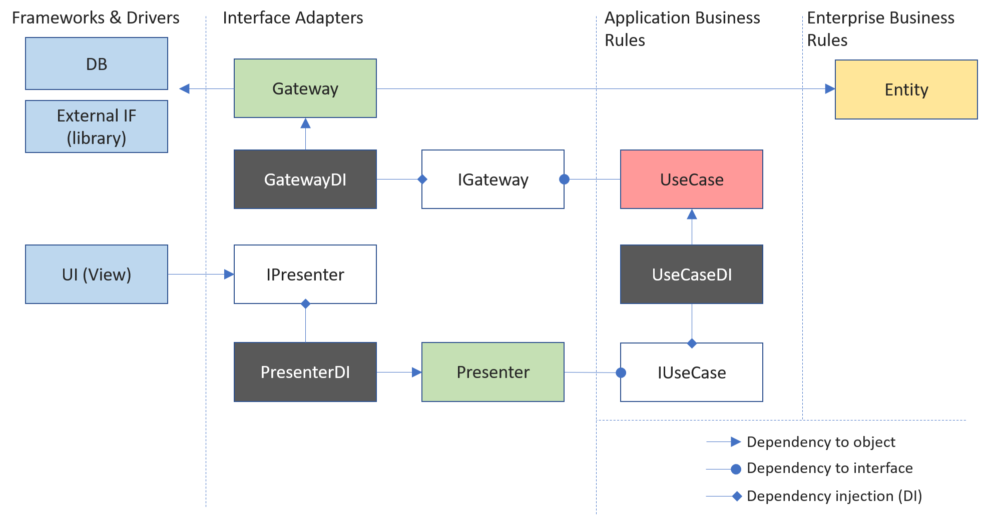

# Simple Clean Architecture Example for Unity

This is an example project of Unity GameEngine to explain the concept of "Simple Clean Architecture".  

## Simple Clean Architecture?
Simple Clean Architecture (SCA) is a software architecture based on the concept of [Clean Architecture](https://blog.cleancoder.com/uncle-bob/2012/08/13/the-clean-architecture.html).
Clean Architecture provides great concept to keep our software clean and less coupled. However, if you make software by the strict guideline of Clean Architecture, your software project structure may be a bit redundant. (e.g., using Repository, Use input port, Data Access, ... to access data)  
SCA is simplified and ready-to-implement design pattern of Clean Architecture. You can see the similarity with MVP, MVVM design patterns. In SCA, we have 5 components (Entity, Gateway, Usecase, Presenter, View) defined in Clean Architecture. Each component should be less coupled and managed by Dependency Injection(DI). We also use Reactive Programming design pattern to communicate each component within less coupled dependency.  
For the detail of Simple Clean Architecture, please refer [this article](https://genki-sano.medium.com/simple-clean-architecture-762b90e58d91).

## Components  
SCA provides you good advantages if your Unity project has a huge codebase. We classify your code logic into 5 groups (Entity, Gateway, Usecase, Presenter, View). Let's see each role.  
- Entity  
  - Entity is responsible for encapsulating the most basic business rules, including primitive objects and methods.
  - Entity can't inherit MonoBehaviour
  - Entity can't depend on Usecase, Gateway, Presenter, View

- Usecase 
  - Usecase can depend on Gateway through its interface.
  - Usecase can’t be dependent on View, Presenter
  - Usecase can’t inherit MonoBehaviour
  - Usecase may depend on other Usecase through its interface (but try to avoid as much as possible)

- Gateway
  - Gateway can't inherit MonoBehaviour
  - Gateway can't depend on View, Presenter, Usecase
  - Gateway may rely on other Gateways through interfaces (but try to avoid as much as possible)

- Presenter
  - Presenter can depend on Usecase through its interface
  - Presenter can’t dependent on View, Gateway
  - Presenter can inherit MonoBehaviour
  - Presenter may rely on other presenters through its interface (but try to avoid as much as possible)

- View
  - View can depend on the Presenter through its interface
  - View can’t depend on another View.
  - View can't depend on Usecase, Gateway
  - View can inherit MonoBehaviour

This diagram shows each component's relationship.

## Dependency Injection  
If you make a loosely coupled software, you need to consider "how to resolve the dependency," meaning who will create the instance. Dependency Injection(DI) in in charge of this functionality. Since DI is popular software design pattern, please search it if you want to more.  
In this example, we are using *Extenject* for DI. For the detail usage of Extenject, please check their github: [Extenject](https://github.com/modesttree/Zenject)

## Reactive Programming  
In SCA, we use the concept of Reactive Programming to have each component communicate with each other. This approach can reverse the direction of dependency. In general (without SCA), internal logic pushes internal data to change to UI to update it. In that case, the internal logic class needs to know the UI class (dependency from inside to outside, or bidirectional dependency). This usual approach increases the coupling between classes. To solve this, we use reactive programing to have UI subscribe the internal logic from outside so that we can keep the direction of the dependency. The following diagram shows the flow of data.  

In this example, we use *UniRx* to achieve such Reactive programming communication. For the detail usage of UniRx, please check their github: [UniRx](https://github.com/neuecc/UniRx).

## Example Scene  
Open this project by Unity. Example scene is `Assets/Scenes/SampleScene.unity`. Example scene contains UI with 2 buttons. It is a simple application, but it has all the components of SCA.  
Some of the View components are attached to Button and Text. View resolves its dependency by `[Inject]` attribute, the feature of Extenject.  
`CounterInstaller` class attached to `SceneContext` GameObject in the scene instantiates Presenter/Gateway/Usecase. Therefore, you can add other components later *without modifying the Unity scene*.  

## Others  
If you prefer to see simpler example NOT using the 3rd party libraries, please also check [this example](https://github.com/genki-tx/UnitySimpleCleanArchitecturePlane)  
